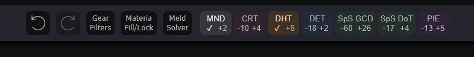

# Xivgear Help

Xivgear is a gear planner for FFXIV.

## Basic Concepts

Similar to gear planning spreadsheets, Xivgear deals with gear sheets which can contain one or more gear sets. A gear
sheet is either specific to a single class, or to an entire role. Each gear set represents a set of equipped items,
materia, food, and relic stats.

## Creating a New Sheet

On the [new sheet](https://xivgear.app/?page=newsheet) page, you can create a sheet. Click the job you want to make
gear sets for. If you want to make a role sheet instead of a single-job sheet, check the "Multi Job" checkbox. You still
need to select a job, which will be used as the default job for new sets.

Give the sheet a name, and select the level. You can also check the "Sync Item Level" box and enter an item level sync.
If you choose a non-max level, then an appropriate sync will be selected automatically.

When your settings look correct, click the "New Sheet" button.

You can access the "new sheet" page by clicking "New Sheet" on the toolbar, or clicking the "New Sheet" button on the
top of the "My Sheets" page.

## Editing a Sheet

Your new sheet will have a single empty set added by default, called "Default Set". Click on this set:

### Equipping Gear: Basics

No items are selected by default. Click a weapon to equip it:

You can click on materia slots to see available materia. Click one to equip it:

To remove a materia, either open the menu again and click the trash icon in the top left, or alt-click the slot. You
can also lock slots such that the [materia autofill](#materia-autofill) and [meld solver](#meld-solver) will not alter
the materia in that slot by ctrl-clicking the slot.

When editing a relic item, click into a cell to edit that stat:

At the bottom of the editor area, you can equip a food item:

The '+142 ✔' indicates that the item in question is providing its full possible Crit bonus of 142, while the '+76 / 85'
indicates that with your current gear, you are only receiving 76 of the possible 85 Spell Speed points.

Finally, hover over an item and click the trash icon to unequip it:

### Equipping Gear: The Toolbar

In the middle of the screen, you'll find the toolbar:

From left to right:
- Undo
- Redo
- [Gear Filters](#gear-filters)
- [Materia Fill/Lock](#materia-autofill)
- [Meld Solver](#meld-solver)
- [Stat Tiering](#stat-tiering)

#### Dragging

You can drag any empty area of the toolbar to move it, to allow for either the editor or the sets table to have more
room.

#### Gear Filters

The Gear Filters panel allows you to change which gear items are displayed. Any item which is currently selected
will be displayed regardless of settings.

Note that some slots have their own controls as well. Notable, weapons have the "Display relics above max ilvl" setting:

This causes the weapons table to display relics which exceed the maximum ilvl, as they are typically optimal.

Food also has an extra setting. By default, only food where both substats are relevant to your class is displayed, but
this checkbox will cause food with only one relevant substat to be displayed as well:

#### Materia Autofill

Materia Autofill allows materia slots to be filled in bulk.

At the top, you can drag and drop the relevant stats to choose the priority of stats. Below that, you can choose a
minimum GCD. Once you have reached this GCD, no more spell/skill speed materia will be equipped. Note that you will
likely only reach this minimum if SkS/SpS is your top priority materia.

Fill mode affects what the editor should do when you equip a new item:
- Leave Empty: Do not fill any materia when selecting an item. All slots will be empty after selecting an item.
- Prio Fill: Fill materia slots automatically according to the priority above.
- Keep Slot, else Prio: Keep the same materia as the previously item in that slot. If no materia were equipped, use priority.
- Keep Item, else Prio: Remember what materia was equipped to each item. If no materia were equipped, use priority.
- Keep Slot, else None: Keep the same materia as the previously item in that slot. If no materia were equipped, leave empty.
- Keep Item, else None: Remember what materia was equipped to each item. If no materia were equipped, leave empty.

Below that are some buttons:
- Fill Empty: Fill all empty and unlocked materia slots according to priority.
- Fill All: Fill all unlocked materia slots according to priority, overwriting existing materia.
- Lock Filled: Lock all filled slots.
- Lock Empty: Lock all empty slots.
- Unlock All: Unlock all slots.
- Remove Unlocked: Remove materia from all unlocked slots.

#### Meld Solver

In order to use this, you need to have a [simulation](#simulations) configured. There may be one configured by 
default when creating a new sheet, but you may wish to alter the settings or switch to a different simulation.

The materia solver will brute force all possible non-redundant meld combinations against a particular simulation, and
keep the best one. The settings allow you to overwrite or keep existing materia, and to force a particular GCD or allow
any GCD. Note that not targeting a specific GCD will lead to there being significantly more meld combinations to test.

After simulating, you will be shown the new meld combination versus the old one, and can either apply the new melds or
keep the existing melds:

#### Stat Tiering

Damage computations in FFXIV make heavy use of rounding. As such, increasing a stat does not necessary change damage
output, because the increase might be entirely lost to roundoff error. A "Stat Tier" refers to the range of values for
a particular stat which result in exactly the same actual output. You can see more about stat tiers on the
[math page](https://xivgear.app/math/).

In our example, we see that our DET tiering is -14 +6 - we can lose up to 14 DET without losing any damage output
(in other words, we have 14 "wasted DET"), and we would need to increase our DET by a minimum of 6 before it has any 
impact (increasing DET by only 5 points would be a waste).

DHT has a checkmark and is glowing. This means that our DHT is perfectly-tiered - we do not have any waste.

You can also click one to expand/collapse it, or double-click to expand/collapse all of them. The extended view shows
what the tiering would look like if you were to gain or lose that many materia:

In this example, our CRT would be tiered perfectly if we were to equip three additional Grade XII materia.

### Gear Editor: Additional Controls

At the top of the editor, we see:
- Set Name
- Optional Set Description
- Job picker - only displayed on multi-job (role-wide) sheets, allowing you to pick a job for each individual sheet.
- Export button - allows the set to be [exported](#exporting)
- Change Name/Description - change the name and description of the set
- Issues - highlights problems with the gear set

#### Gear Set Issues

Gear set issues are divided into errors and warnings. You can click the "X Issues" button to see them. Issues are also
indicated with icons in the sets table:

Common issues with sets include:
- No weapon equipped (error) - sims cannot properly compute auto-attacks with no weapon equipped, and it is 
  impossible to have no weapon equipped in-game.
- Same unique ring equipped in both the left and right ring slots (error).
- One or more materia is pushing the item significantly over the cap for that stat, and thus is completely or partially
  wasted (warning).

#### Showing/Hiding Slots

You can click on a slot header to expand/collapse that slot. When collapsed, only the selected item (if any) will be 
shown. You can double-click to show/hide all slots:

## Sets Table

Now that you're familiar with the set editor, look back up above the toolbar. The table at the top holds your gear sets.

You can click the hamburger menu to show/hide the navigation bar at the top of the page.

In the leftmost column, you'll see three icons:
- Trash: Delete this set. Hold alt while clicking to bypass the confirmation.
- Copy: Duplicate this set.
- Drag: Click and drag to re-order sets in the table.

To the right of that is the set names, plus icons for [issues](#gear-set-issues). Role-wide sheets will also display
the job icon for that particular set.

Next is simulation results, if the sheet contains any [simulations](#simulations). Each sim will have its own column.
You can click the column header to change settings for the simulation, and can click a results cell to see more details.

To the right of simulations is GCD. As seen with this set, some classes may display multiple GCD measurements, such
as WHM with its normal GCD and GCD under Presence of Mind.

Next up are stats. Only stats which are relevant to the class in question will be displayed. Some stats may display
additional information, such as the crit rate and multiplier, determination multiplier, or tenacity multiplier and
incoming damage reduction.

Below the table are some set-wide controls:
- New Gear Set: Add a new gear set from scratch.
- More Actions...: Menu with additional actions
  - Name/Description: Change the name and description of the whole sheet
  - Manage Custom Items: Edit [custom items](#custom-items-and-food)
  - Manage Custom Food: Edit [custom food](#custom-items-and-food)
  - Add Separator: Adds an entry to the table which can be used as a visual divider or an information page
  - Sheet/Set info: Display some additional information about the sheet, such as timestamp
  - Save As: Save the sheet under a new name, with the option to alter the level, item level, and/or job
- Add Simulation: Add a [simulation](#simulations)
- Export Whole Sheet: [export](#exporting) the whole sheet
- Import Sets: [import](#importing) existing sets or a sheet into this sheet
- Race/Clan dropdown: Change the race/clan used for the sheet
- Party Bonus: Change the number of unique roles used to calculate the party bonus (0 - 5%).

### Simulations

Xivgear supports community-contributed simulations.
All classes can make use of the builtin potency ratio "simulation" which calculates the expected damage
of a 100 potency action. Some classes may have their own simulation implementations as well.

Each simulation added to the sheet will show up as a column. If a simulation has settings, 
you can configure them by clicking the column header for the simulation. Some simulations also have detailed
results, which can be seen by clicking the result cell. The cell will display the "main" damage/DPS result,
with the color gradient going from highest result (green) to lowest (red). Note that the gradient will not go
all the way to red if the difference between the best- and worst-performing sets is small.

#### Rotation Sims

Some classes have a full rotation sim. You can click the result cell to see the entire rotation used:

You can see that this simulation has multiple possible rotations. The highest-DPS rotation will be chosen by default,
but you can view the skills used for other rotation strategies by clicking on them:

The results table has the following columns:
- Time: when the skill was used. This is the time that the button would have been pressed, so the first skill will
  typically be used at a negative (i.e. pre-pull) time. You can hover over the cell for more detailed information such
  as when the skill snapshotted, how much application delay was accounted for, and the cast time.
- Skill name and icon
- Raw Potency: This includes DoT ticks. Auto-attacks will show the raw potency, without adjusting for weapon-related
  stats.
- Damage: the overall damage. This includes DoT ticks. If you see a '*', it means that either a DoT lost ticks due to
  being overwritten or the fight ending, or that a skill was pro-rated due to not fitting into the fight time.
- Gauge: classes with gauges will show their gauge state after using the skill.
- Buffs: Shows both the overall buff state, as well as active status effects.

To configure the sim, click the column header. You can change the fight time, whether to use auto-attacks, what party
buffs are present or not, and optionally add or subtract standard deviations from the result to simulate better or
worse variance luck. Single-target party buffs such as AST cards and Devilment are disabled by default.

Now that we've enabled some buffs, we can see them in the sim results:

#### Usage Count Sims

Classes such as DNC with RNG proc-based rotations may opt to use a simpler model for their simulations, where we instead
compute the expected count of each skill in a particular duration, including how many of those skills fit into which
duration of buffs:

### Custom Items and Food

Xivgear allows for custom items and food to be created from scratch.

To begin, click More Actions... > Manage Custom Items (or Food). Start by clicking "New Item..." and then select the
slot you'd like to create. 

Then, enter the information for the item. Some stats are only available on weapons. You can choose how many "large"
and "small" (i.e. Materia 7/9/11 only) slots to add to the item.

The "cap" checkbox to the right of the ilvl box determines whether the item will respect ilvl caps and ilvl sync, or
if it will use all of the entered stats as-is. Stats which are relatively fixed based on the ilvl will be pre-filled.

When you click into a cell (or double click), it will suggest the appropriate values for the primary and secondary 
substat:

Adding custom food follows the same process, but instead of being able to enter arbitrary stats, you 
choose the primary and secondary substat, and enter the percentage and cap for both stats as well as Vitality.

## Exporting

To share your sheets or sets with other people, or to use them with other tools, you will need to export them.

You can export an entire sheet or an individual set, but it is generally recommended that you export the entire set so
that sets can be compared easily. You can click "Export Whole Sheet" below the sets table, or select an individual set 
and click "Export This Set". The export options will be slightly different depending on whether you are exporting
a sheet or a set.

When exporting a sheet, you can choose:
1. Link to Whole Sheet: One URL will be generated for the whole sheet, such as [https://xivgear.app/?page=sl%7Cdd3d5b52-bc9c-4acf-bc06-7b89076e7e58](https://xivgear.app/?page=sl%7Cdd3d5b52-bc9c-4acf-bc06-7b89076e7e58).
2. One Link for Each Set: One URL will be generated for each set. The invidual URLs allow you to navigate back to the 
   full sheet, so this is a good way to link individual sets while still providing access to the full sheet. Example: [https://xivgear.app/?page=sl%7C9752ab9a-e2aa-43f9-a409-8a4f029b8a8c&onlySetIndex=2](https://xivgear.app/?page=sl%7C9752ab9a-e2aa-43f9-a409-8a4f029b8a8c&onlySetIndex=2).
3. Embed URL for Each Set: Like #2, but uses the more compact embedded UI. Best option for when you are embedding
   the gear set on another website. Example: [https://xivgear.app/?page=embed|sl|9752ab9a-e2aa-43f9-a409-8a4f029b8a8c&onlySetIndex=2](https://xivgear.app/?page=embed|sl|9752ab9a-e2aa-43f9-a409-8a4f029b8a8c&onlySetIndex=2).
4. JSON for whole sheet: Exports the sheet in raw JSON form. Useful for [importing](#importing) into another sheet or into
   other tools.

When exporting an individual set, you can choose from:
1. Link to This Set: One URL will be created for the set. It will not link back to the entire sheet, but sheet-level
   properties such as race, party bonus, and simulations will be carried over.
2. Embed URL for This Set: Like #1, but uses the compact embedded UI.
3. JSON for This Set: Raw JSON.
4. Export to Teamcraft: Generates a Teamcraft URL for this set. You can click the "Go" button to navigate there.

When using either option, you can choose which simulations to include in the export:

When you export, the link will lead to a special read-only view. In order to edit, you must use the "Save As" button
under "More Actions..." to save the set to your sets.

### Features Specific to View-Only UI

When viewing an export, the UI is a bit different. Features only relevant to editing are removed in favor of a cleaner
UI:

## Importing

You can import in one of two ways:
1. As a new sheet
2. Into an existing sheet

To import as a new sheet, you can click the "Import" button in the top navigation bar, and paste the link/JSON. In
addition, if the sheet you are trying to import is a Xivgear link, you can also just use More Actions > Save As to save
the sheet into your saved sheets.

To import onto an existing sheet, click the "Import" button under the sets table, and paste the link.

In addition to Xivgear URLs or JSON, you can import Etro links.
